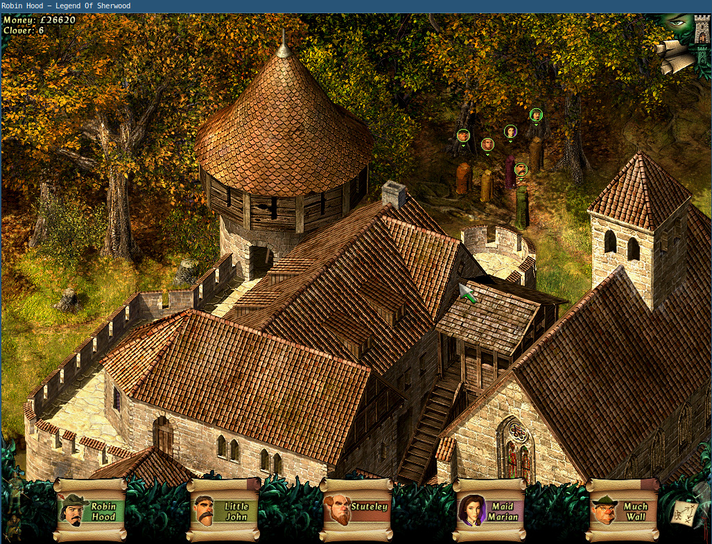
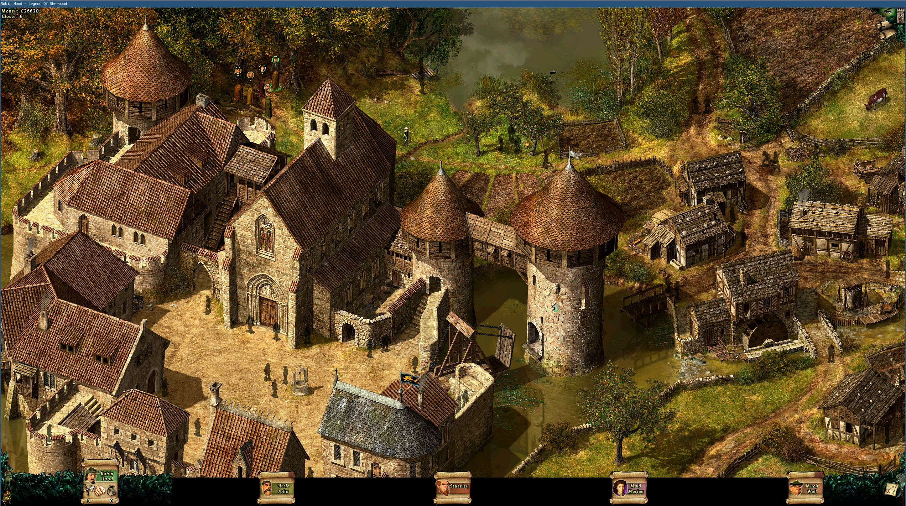
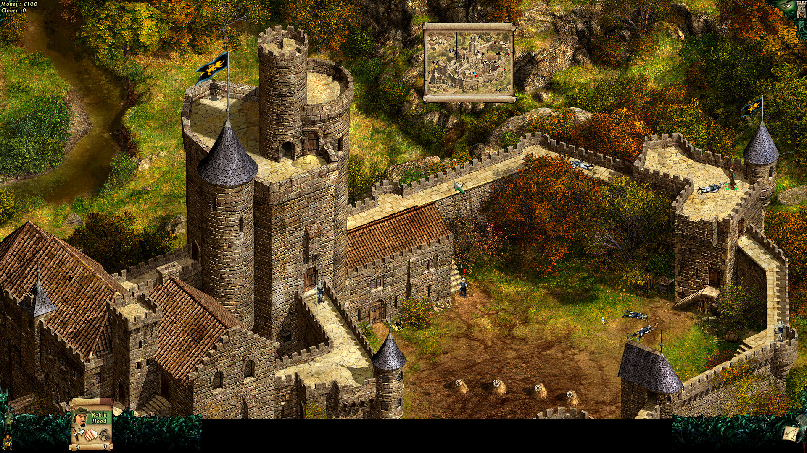

`Robin Hood: The Legend of Sherwood` is a great game that was released in 2002. The [Linux version](http://www.rune-soft.com/Games/Released/Game-239/game=Robin_Hood_The_Legend_of_Sherwood-13) ([Desura](http://www.desura.com/games/robin-hood-the-legend-of-sherwood)) was released in 2005.

## Before:



## After:






The game natively only supports 640x480, 800x600 and 1024x768. Which is tiny on a modern display. I found the location where the current resolution is saved by chosing all different resolutions ingame and doing a binary diff on the resulting savegame file.

The resolution is stored per profile slot in the save game file, with the first save game being at binary offset 0x104, and the second at binary offset 0xd5e. They are stored as floats for some reason, but you can simply replace those floats and the game will run at any resolution.

```sh
$ ./respatcher.elf 2560 1440
Savegame Offset 0x104, Resolution was 1920x1080
Resolution set to 2560x1440
```

I opened an issue about this on the public issue tracker (https://bitbucket.org/runesoftdev/robinhood_public/issues/2/maximum-resolution-available-belongs-in) since I knew the fix was fairly easy. They said they didn't want to change it because higher resolutions result in some issues such as the UI not scaling 100% correctly. I still think 1920x1080 is far better than running at 1024x768, but I recommend not setting the resolution any higher since then some maps are smaller than your screen which causes the cursor to freak out a bit at the edges.

I first posted this patch in 2012 on Desura (http://www.desura.com/games/robin-hood-the-legend-of-sherwood) where I bought the Linux version.

Since there is still discussion about this on the Steam version and people are playing this game in 2018
(

* https://steamcommunity.com/app/46560/discussions/0/882959697731515581/
* https://steamcommunity.com/app/46560/discussions/0/35220315567529271/
* https://steamcommunity.com/app/46560/discussions/0/810938082782141946/
* https://steamcommunity.com/app/46560/discussions/0/828940351679978347/
* https://steamcommunity.com/app/46560/discussions/0/1486613649679433637/
* https://steamcommunity.com/app/46560/discussions/0/1843493219427746731/
* https://steamcommunity.com/app/46560/discussions/0/624075036328200733/
)

I'm posting this patcher again on GitHub.


On a semi-related note, there are some undocumented flags on the (Linux) executable.

* -NOINPUTGRAB
* -NOFULLSCREEN
* -FULLSCREEN
* -NOSCRIPT
* -CHECKSOUNDDATA
* -GENERATESKIPDATA
* -SETREG
* -GETMAJORVER
* -GETMINORVER
* -GETBUILRHER
* -SIMULATE
* -EXTRACTHUNK
* -GAMEPAD

I always run the game in windowed mode without input grab (`-NOFULLSCREEN -NOINPUTGRAB`) moving the screen around with the keyboard instead. Alt+G ([Or Ctrl+G](https://bitbucket.org/runesoftdev/robinhood_public/wiki/Changelog)) toggles the mouse grab.